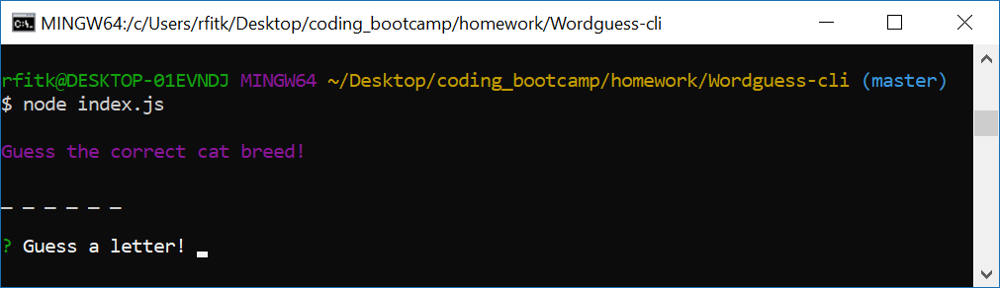

# Wordguess-cli
`Cat Breed Hangman`

### User Instructions

1. After downloading the repository, navigate to repository folder in your terminal and type the following commands:
    npm install inquirer
    
    npm install colors
    

2. Run the file with this command:
    node index.js
    

3. Enter letters one at a time, pressing enter after each one to try and guess the correct cat breed. After running out of guesses or correctly guessing the word, you will be given another one to play again.
